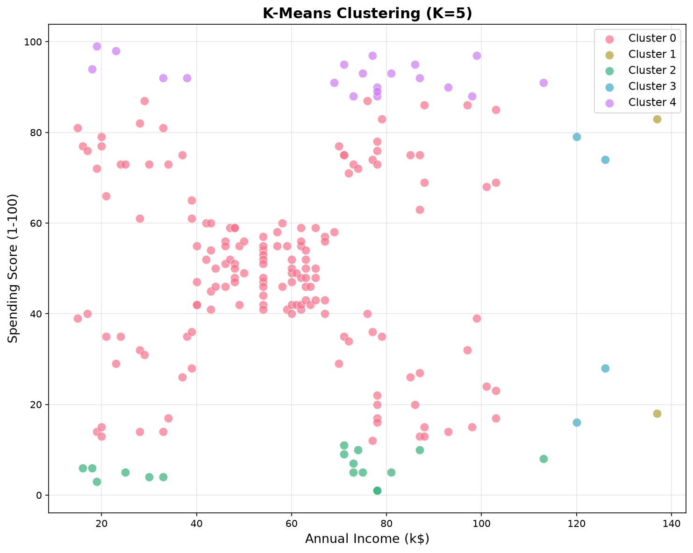
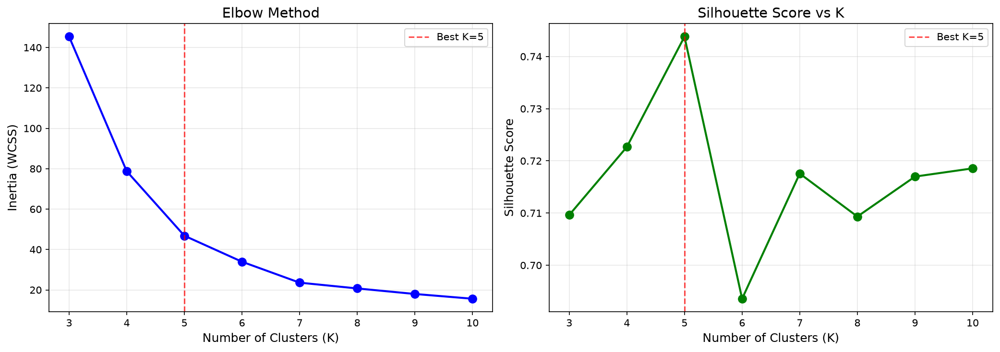
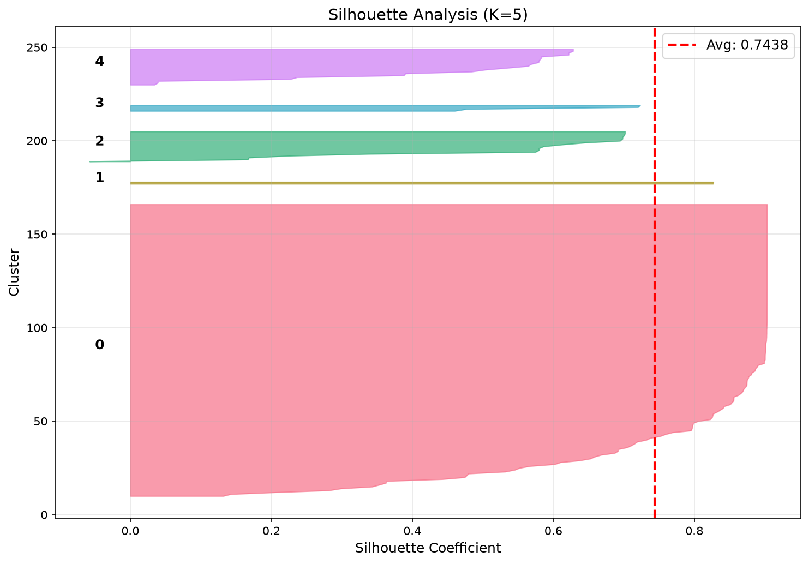

# Customer Segmentation using K-Means Clustering

A production-grade customer segmentation system that identifies distinct customer groups from mall shopping data using unsupervised machine learning. The project includes a trained K-Means model, a deployed REST API on Vercel, and an interactive Streamlit dashboard for exploration and business insights.

**Live API:** [data-psi-blue.vercel.app/api](https://data-psi-blue.vercel.app/api)
**Live Dashboard:** *Streamlit Cloud (see deployment section)*

---

## Table of Contents

- [Problem Statement](#problem-statement)
- [Business Use Case](#business-use-case)
- [Dataset](#dataset)
- [Methodology](#methodology)
- [Results](#results)
- [API Documentation](#api-documentation)
- [Streamlit Dashboard](#streamlit-dashboard)
- [Project Structure](#project-structure)
- [Installation](#installation)
- [Deployment](#deployment)
- [Technologies Used](#technologies-used)
- [Future Improvements](#future-improvements)
- [Author](#author)

---

## Problem Statement

Retail businesses collect vast amounts of customer data but often lack actionable segmentation strategies. Without understanding distinct customer groups, marketing spend is wasted on generic campaigns that fail to resonate with specific audiences.

This project applies **K-Means clustering** to segment 200 mall customers based on their **Annual Income** and **Spending Score**, enabling data-driven marketing decisions.

---

## Business Use Case

| Segment | Strategy |
|---------|----------|
| High Income, High Spending | VIP loyalty programs, exclusive offers |
| High Income, Low Spending | Premium product recommendations, engagement campaigns |
| Low Income, High Spending | Reward programs, installment plans |
| Low Income, Low Spending | Budget-friendly promotions, re-engagement |
| Average Customers | General campaigns, cross-selling |

Segmentation enables:
- **Targeted marketing** with personalized campaigns per segment
- **Resource optimization** by focusing spend on high-value clusters
- **Customer retention** through tailored engagement strategies
- **Revenue growth** by identifying upsell/cross-sell opportunities

---

## Dataset

**Source:** [Mall Customers Dataset (Kaggle)](https://www.kaggle.com/datasets/vjchoudhary7/customer-segmentation-tutorial-in-python)

| Feature | Description | Type |
|---------|-------------|------|
| CustomerID | Unique identifier | Integer |
| Gender | Male / Female | Categorical |
| Age | Customer age | Integer |
| Annual Income (k$) | Annual income in thousands | Integer |
| Spending Score (1-100) | Mall-assigned score based on behavior | Integer |

- **Samples:** 200 customers
- **Features used for clustering:** Annual Income, Spending Score
- **Missing values:** None

---

## Methodology

### 1. Data Preprocessing (`preprocess.py`)

```
Raw Data -> Feature Selection -> Power Transformation (p=5) -> Standard Scaling
```

- Extract **Annual Income** and **Spending Score** as clustering features
- Apply a **power transformation** (exponent=5) to amplify separation between dense groups
- Re-scale with **StandardScaler** to normalize the transformed features

### 2. Optimal K Selection (`kmeans_model.py`)

Two complementary methods determine the best number of clusters:

#### Elbow Method
Plots inertia (within-cluster sum of squares) against K. The "elbow" point indicates diminishing returns from adding more clusters.

#### Silhouette Analysis
Measures how similar each point is to its own cluster vs. neighboring clusters. Score ranges from -1 (wrong cluster) to +1 (well-clustered). Higher is better.

| K | Inertia | Silhouette Score |
|---|---------|-----------------|
| 3 | 145.35 | 0.7096 |
| 4 | 78.73 | 0.7227 |
| **5** | **46.82** | **0.7438** |
| 6 | 33.94 | 0.6936 |
| 7 | 23.59 | 0.7176 |

**Best K = 5** with a silhouette score of **0.7438**.

### 3. Model Training

- Algorithm: **K-Means++** (smart centroid initialization)
- Evaluated across **20 random seeds** to find the globally best partition
- Each seed runs with `n_init=50` and `max_iter=500`

---

## Results

### Cluster Scatter Plot


### Elbow Method & Silhouette Score


### Silhouette Analysis per Cluster


### Cluster Profiles

| Cluster | Size | Avg Income (k$) | Avg Spending Score | Silhouette |
|---------|------|------------------|--------------------|------------|
| 0 | 157 | 56.97 | 49.62 | 0.8107 |
| 1 | 2 | 137.00 | 50.50 | 0.8267 |
| 2 | 17 | 59.71 | 5.88 | 0.5066 |
| 3 | 4 | 123.00 | 49.25 | 0.5950 |
| 4 | 20 | 69.35 | 92.60 | 0.4416 |

---

## API Documentation

### Base URL
```
https://data-psi-blue.vercel.app
```

### Endpoints

#### `GET /api`
Returns API documentation and available endpoints.

**Response:**
```json
{
  "project": "Mall Customers K-Means Clustering API",
  "endpoints": {
    "GET /api": "This help message",
    "GET /api/cluster": "Get clustering results (5 segments, 200 customers)"
  },
  "source": "https://github.com/timijaycr7/Mall-Customers-KMeans-Clustering"
}
```

#### `GET /api/cluster`
Returns the complete clustering results including model metadata, K evaluation metrics, cluster profiles, and per-customer assignments.

**Response structure:**
```json
{
  "model": {
    "k": 5,
    "overall_silhouette_score": 0.7438,
    "total_customers": 200
  },
  "k_evaluation": [...],
  "clusters": [...],
  "customers": [...]
}
```

#### `GET /api/predict?income=<value>&score=<value>`
Real-time prediction for a new customer. Applies the same preprocessing pipeline (StandardScale -> Power(5) -> StandardScale) and assigns the nearest cluster using embedded model centroids — no scikit-learn dependency at runtime.

**Example:** `/api/predict?income=75&score=90`

**Response:**
```json
{
  "annual_income": 75.0,
  "spending_score": 90.0,
  "cluster": 4,
  "segment_name": "Big Spenders"
}
```

### Prediction Architecture

```
User Input (income, score)
        │
        ▼
┌───────────────────┐     ┌──────────────────────┐
│  Vercel API       │     │  Embedded Model       │
│  /api/predict     │────▶│  - Scaler params      │
│                   │     │  - Power transform    │
│                   │◀────│  - Centroids (5)      │
│  Returns JSON     │     │  - Euclidean distance │
└───────────────────┘     └──────────────────────┘
```

### Segment Names

| Cluster | Segment Name | Description |
|---------|-------------|-------------|
| 0 | Average Joes | Moderate income, moderate spending |
| 1 | Elite Outliers | Very high income, moderate spending |
| 2 | Budget Savers | Moderate income, very low spending |
| 3 | Affluent Moderates | High income, moderate spending |
| 4 | Big Spenders | Moderate income, very high spending |

---

## Streamlit Dashboard

An interactive frontend built with Streamlit that consumes the Vercel API.

### Pages

| Page | Description |
|------|-------------|
| Home | Project overview, architecture, methodology |
| Dataset Explorer | Data preview, statistics, distributions |
| Clustering Dashboard | Live API results, interactive scatter plots |
| Analytics | Cluster profiles, business personas, recommendations |

### Run Locally

```bash
cd streamlit_app
pip install -r requirements.txt
streamlit run app.py
```

---

## Project Structure

```
Mall-Customers-KMeans-Clustering/
│
├── Mall_Customers.csv              # Raw dataset
├── preprocess.py                   # Data loading and feature engineering
├── kmeans_model.py                 # Model training, evaluation, and plotting
├── cluster_results.json            # Precomputed clustering results
│
├── api/                            # Vercel serverless API
│   └── index.py                    # API handler (GET /api, GET /api/cluster)
│
├── streamlit_app/                  # Interactive dashboard
│   ├── app.py                      # Main Streamlit entry point
│   ├── pages/
│   │   ├── Home.py
│   │   ├── Dataset.py
│   │   ├── Clustering.py
│   │   └── Analytics.py
│   ├── services/
│   │   └── api_client.py           # Vercel API client
│   ├── utils/
│   │   └── helpers.py              # Shared utilities
│   └── .streamlit/
│       └── config.toml             # Theme configuration
│
├── assets/                         # Screenshots and images
├── cluster_scatter.png
├── elbow_silhouette.png
├── silhouette_analysis.png
├── requirements.txt                # Python dependencies (ML pipeline)
├── requirements-local.txt          # Full local dependencies
├── vercel.json                     # Vercel deployment config
└── README.md
```

---

## Installation

### Prerequisites
- Python 3.10+
- pip

### Clone and Setup

```bash
git clone https://github.com/timijaycr7/Mall-Customers-KMeans-Clustering.git
cd Mall-Customers-KMeans-Clustering
```

### Run the ML Pipeline

```bash
pip install -r requirements-local.txt
python kmeans_model.py
```

### Run the Streamlit Dashboard

```bash
cd streamlit_app
pip install -r requirements.txt
streamlit run app.py
```

---

## Deployment

### API (Vercel)
The REST API is deployed as a Python serverless function on Vercel. It serves precomputed clustering results with zero cold-start ML dependencies.

### Dashboard (Streamlit Cloud)
1. Push the repository to GitHub
2. Go to [share.streamlit.io](https://share.streamlit.io)
3. Select your repository
4. Set main file path: `streamlit_app/app.py`
5. Deploy

---

## Technologies Used

| Category | Technology |
|----------|-----------|
| Language | Python 3.12 |
| ML / Data | scikit-learn, pandas, NumPy |
| Visualization | Matplotlib, Seaborn, Plotly |
| Dashboard | Streamlit |
| API | Vercel Serverless Functions |
| Deployment | Vercel, Streamlit Cloud |
| Version Control | Git, GitHub |

---

## Future Improvements

- [ ] Add more features (Age, Gender) with encoding for richer segmentation
- [ ] Implement DBSCAN and Hierarchical Clustering for comparison
- [ ] Add real-time clustering with user-uploaded CSV files
- [ ] Build customer lifetime value (CLV) prediction per segment
- [ ] Add A/B testing simulation for marketing strategies
- [ ] Integrate with a database for dynamic data ingestion

---

## Author

**Bankole Jeremiah Adeoye**
- GitHub: [@timijaycr7](https://github.com/timijaycr7)
- Email: bankolejeremiahadeoye@gmail.com

---

*Built with Python, scikit-learn, Streamlit, and Vercel.*
